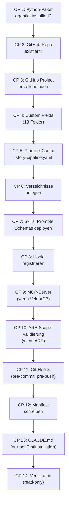

# 50 — Installer, Checkpoint-Engine und Bootstrap

## 50.1 Zweck

AgentKit installiert sich über eine Folge idempotenter Checkpoints
selbst in ein Zielprojekt (FK 11). Jeder Checkpoint prüft den
bestehenden Zustand und führt nur fehlende Aktionen aus. Das
bedeutet: Der Installer kann beliebig oft laufen — er erzeugt
keine Duplikate und überschreibt keine nutzerseitigen Anpassungen.

## 50.2 Aufruf

```bash
# Erstinstallation
agentkit install --gh-owner acme-corp --gh-repo trading-platform

# Erneut laufen (idempotent)
agentkit install --gh-owner acme-corp --gh-repo trading-platform

# Dry-Run (zeigt was passieren würde)
agentkit install --gh-owner acme-corp --gh-repo trading-platform --dry-run

# Verifikation (read-only Prüfung)
agentkit verify
```

## 50.3 Vierzehn Checkpoints



### CP 1: Python-Paket

Prüft ob `agentkit` als Python-Paket verfügbar ist:

```python
import agentkit
assert agentkit.__version__
```

**Idempotenz:** Nur Prüfung, keine Aktion.

### CP 2: GitHub-Repo

Prüft ob das Repo existiert und `gh` CLI authentifiziert ist:

```bash
gh repo view {owner}/{repo} --json name
```

**Idempotenz:** Nur Prüfung.

### CP 3: GitHub Project

Sucht ein bestehendes GitHub Project V2 oder erstellt ein neues:

```bash
gh project list --owner {owner} --format json
# Wenn nicht gefunden:
gh project create --owner {owner} --title "AgentKit - {repo}"
```

**Idempotenz:** Erstellt nur wenn nicht vorhanden.

### CP 4: Custom Fields

Stellt sicher, dass alle 13 Custom Fields existieren (Kap. 12.2.1).
Prüft den bestehenden Zustand und erstellt nur fehlende Fields.
Vorhandene Fields werden nicht verändert.

**13 Felder:** Status, Story ID, Story Type, Size, Change Impact,
New Structures, Concept Quality (Pflicht, High/Medium/Low),
QA Rounds, Completed At, Module, Epic, Primary Repo,
Participating Repos.

REF-032 + Remediation: Maturity, External Integrations und
Requires Exploration entfernt; Concept Quality hinzugefügt.

**Idempotenz:** Nur fehlende Fields erstellen.

### CP 5: Pipeline-Config

Erzeugt `.story-pipeline.yaml` wenn nicht vorhanden. Bei
bestehender Datei: prüft `config_version`, migriert bei Bedarf
(Kap. 51).

**Idempotenz:** Überschreibt nie bestehende Config.

### CP 6: Verzeichnisse

Erstellt die Verzeichnisstruktur (Kap. 10.3.1):

```
_temp/qa/
_temp/story-telemetry/
_temp/governance/
_temp/governance/locks/
_temp/governance/active/
_temp/adversarial/
.agentkit/failure-corpus/
.agent-guard/
worktrees/
stories/
concepts/
_guardrails/
prompts/
prompts/sparring/
skills/
tools/hooks/
tools/qa/schemas/
```

**Idempotenz:** `mkdir -p` (erstellt nur wenn nicht vorhanden).

### CP 7: Skills, Prompts, Schemas

Kopiert Dateien aus dem AgentKit-Paket ins Zielprojekt:

- `userstory/skills/` → `skills/`
- `userstory/prompts/` → `prompts/`
- `userstory/schemas/` → `tools/qa/schemas/`
- `userstory/templates/` → `templates/`
- `ccag/bundle/rules/` → `.claude/ccag/rules/`

Platzhalter-Substitution in `.md`-Dateien (Kap. 43.4.2).

**Idempotenz:** Vergleicht Source-Hash mit Manifest. Nur
geänderte Dateien werden überschrieben. Nutzer-Anpassungen werden
als `.bak` gesichert.

### CP 8: Hooks registrieren

Schreibt Hook-Einträge in `.claude/settings.json` (Kap. 30.3.1).
Merge-Modus: bestehende Hooks bleiben erhalten, nur fehlende
AgentKit-Hooks werden hinzugefügt.

**Idempotenz:** Prüft ob jeder Hook bereits registriert ist.

### CP 9: MCP-Server

Nur wenn `features.vectordb: true`. Registriert den
Story-Knowledge-Base MCP-Server in `.mcp.json`:

```json
{
  "mcpServers": {
    "story-knowledge-base": {
      "type": "stdio",
      "command": "python",
      "args": ["{agentkit_path}/userstory/vectordb/mcp_server.py"],
      "env": { ... }
    }
  }
}
```

Auch ARE-MCP-Server wenn `features.are: true`.

**Idempotenz:** Prüft ob Server bereits registriert ist.

### CP 9a: ConceptContext-Properties und Erstindizierung

Nur wenn `features.vectordb: true`. Erweitert die `StoryContext`-
Collection um konzeptspezifische Properties (Kap. 13.9.3):

1. Prüft ob die neuen Properties (`concept_id`, `is_appendix`,
   `parent_concept_id`, `defers_to`, `authority_over`,
   `section_number`, `normative_rules`, `concept_status`)
   in der Collection existieren
2. Fügt fehlende Properties hinzu (Weaviate Schema-Update)
3. Registriert `concept_search` und `concept_sync` Tools im
   bestehenden Story-Knowledge-Base MCP-Server
4. Führt Erstindizierung aller Konzeptdokumente mit gültigem
   Frontmatter durch (`concept_sync(full_reindex=true)`)

**Abhängigkeiten:** CP 9 (MCP-Server muss registriert sein).

**Idempotenz:** Prüft ob Properties bereits existieren. Überspring
bereits indizierte Konzepte (Hash-basiert).

### CP 9b: Concept-Validation-Hook

Registriert den konzeptspezifischen Pre-Commit-Hook (Kap. 13.9.9)
in `tools/hooks/pre-commit`. Der Hook führt bei Änderungen unter
`_concept/` die Validierungs-Suite `concept_validate --staged` aus.

Die bestehende Secret-Detection (Kap. 15.5.2) bleibt global aktiv
und wird durch die pfadbasierte Dispatching-Logik nicht berührt.

**Abhängigkeiten:** CP 11 (Git-Hooks müssen konfiguriert sein).

**Idempotenz:** Prüft ob Dispatching-Logik bereits im Hook
enthalten ist.

### CP 10: ARE-Scope-Validierung

Nur wenn `features.are: true`.

- Prüft: Alle Code-Repos in `repos[]` haben `are_scope` gesetzt. Alle Modul-Werte aus dem GitHub Project haben Eintrag in `are.module_scope_map`
- Erkennt Deltas automatisch: nur neue/unmapped Items lösen Abfrage aus
- Interaktiver Modus: nummerierte Auswahl aus ARE-Scopes (Quelle: ARE-API `/dimensions/scope` oder Fallback auf bereits konfigurierte Scopes)
- Agentischer Modus: gibt `PENDING_SELECTION` zurück mit Metadaten, orchestrierender Agent muss `resolve_pending_scope_mapping()` aufrufen
- Idempotenz: bereits zugeordnete Items werden nicht erneut abgefragt

**Abhängigkeiten:** CP 5 (Pipeline-Config), CP 4 (Custom Fields), CP 9 (ARE MCP-Server)

**Idempotenz:** Nur fehlende/unmapped Einträge werden abgefragt.

### CP 11: Git-Hooks

Installiert `pre-commit` Hook (Secret-Detection, Kap. 15.5.2)
und `pre-push` Hook:

```bash
# Setzt core.hooksPath auf tools/hooks/
git config core.hooksPath tools/hooks/
```

**Idempotenz:** Prüft ob hooksPath bereits gesetzt ist.

### CP 12: Manifest

Schreibt `.installed-manifest.json` mit:

- AgentKit-Version und Commit-SHA
- Installationszeitpunkt
- GitHub-Project-ID und Field-IDs (aus CP 3/4)
- Datei-Map mit Source-Hashes (aus CP 7)
- Feature-Flags zum Zeitpunkt der Installation

**Idempotenz:** Wird bei jedem Lauf aktualisiert (ist der
Zustandsträger).

### CP 13: CLAUDE.md

Erzeugt ein Skelett für die `CLAUDE.md`-Datei des Projekts.
**Nur bei Erstinstallation** — wird nie überschrieben, weil
CLAUDE.md ein vom Menschen gepflegtes Dokument ist.

**Idempotenz:** Nur erstellen wenn nicht vorhanden.

### CP 14: Verifikation

Read-only Validierung aller vorherigen Checkpoints:

- Config lesbar und Schema-valide?
- Alle Verzeichnisse existieren?
- Alle Skills/Prompts/Schemas deployt?
- Alle Hooks registriert?
- Manifest konsistent?
- GitHub-Fields vorhanden?
- ARE-Scope-Zuordnung vollständig? (alle Code-Repos haben `are_scope`, alle Modul-Werte gemappt — nur wenn `features.are: true`)

**Ergebnis:** PASS oder Liste von Problemen.

## 50.4 Checkpoint-Ergebnis

```python
@dataclass
class CheckpointResult:
    checkpoint: str     # z.B. "cp_04_github_fields"
    status: str         # PASS, CREATED, UPDATED, SKIPPED, FAILED
    detail: str         # Menschenlesbare Beschreibung
    duration_ms: int    # Ausführungsdauer
```

| Status | Bedeutung |
|--------|----------|
| PASS | Checkpoint war bereits erfüllt, keine Aktion nötig |
| CREATED | Neues Artefakt erstellt |
| UPDATED | Bestehendes Artefakt aktualisiert |
| SKIPPED | Nicht relevant (z.B. VektorDB bei `vectordb: false`) |
| FAILED | Checkpoint gescheitert — Installation abbrechen |

## 50.5 SQLite-DB Bootstrap

Beim Installer-Run wird die Telemetrie-DB initialisiert:

```python
def bootstrap_db():
    with sqlite3.connect("_temp/agentkit.db") as conn:
        conn.execute("""
            CREATE TABLE IF NOT EXISTS events (
                id INTEGER PRIMARY KEY AUTOINCREMENT,
                story_id TEXT NOT NULL,
                run_id TEXT NOT NULL,
                ts TEXT NOT NULL,
                event_type TEXT NOT NULL,
                pool TEXT,
                role TEXT,
                payload TEXT,
                created_at TEXT DEFAULT (datetime('now'))
            )
        """)
        conn.execute("CREATE INDEX IF NOT EXISTS idx_events_story_type ON events(story_id, event_type)")
        conn.execute("CREATE INDEX IF NOT EXISTS idx_events_run ON events(run_id)")
```

## 50.6 Fehlerbehandlung

| Fehler | Checkpoint | Reaktion |
|--------|-----------|---------|
| `gh` nicht installiert | CP 2 | FAILED, Installation abbrechen |
| `gh` nicht authentifiziert | CP 2 | FAILED, Hinweis auf `gh auth login` |
| Repo nicht gefunden | CP 2 | FAILED |
| GitHub API Rate Limit | CP 3/4 | Retry mit Backoff, dann FAILED |
| Keine Schreibrechte im Projekt | CP 6 | FAILED |
| Bestehende Config mit inkompatiblem Schema | CP 5 | Migration versuchen (Kap. 51), bei Scheitern FAILED |

**Bei FAILED:** Alle vorherigen Checkpoints waren erfolgreich und
bleiben erhalten. Der Installer kann nach Problembehebung erneut
gestartet werden — Idempotenz garantiert, dass bereits erledigte
Checkpoints nicht wiederholt werden.

---

*FK-Referenzen: FK-11-001 bis FK-11-009 (Installation komplett)*
