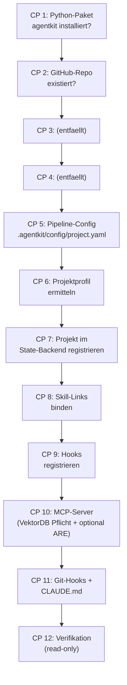

# 50 — Installer, Checkpoint-Engine und Bootstrap

## 50.1 Zweck

<!-- PROSE-FORMAL: formal.installer.entities, formal.installer.invariants, formal.skills-and-bundles.entities, formal.skills-and-bundles.invariants -->

AgentKit wird systemweit installiert und registriert anschließend ein
Zielprojekt über eine Folge idempotenter Checkpoints (FK 11). Das
Zielprojekt erhält lokale Konfiguration und harness-spezifische
Link-Bindungen für Skills (Symlink auf POSIX, Directory Junction auf
Windows; Claude Code, Codex; FK-76 §76.7), aber
keine kopierten AgentKit-Laufzeitartefakte.

**Architekturzuordnung:** Der Installer ist im Komponentenmodell eine
eigene Top-Level-Komponente. Er ist kein Teil der `PipelineEngine`,
sondern vorgelagerter Bootstrap- und Registrierungsmechanismus für
Projekte, Hooks, Skill-Bindungen und Backend-Registrierung.

**Einordnung in die drei Installationsebenen (FK-10 §10.2.0):** Dieser
Checkpoint-Installer ist der Mechanismus der **Ebene 3 (Projektraum)**.
Die anderen zwei Ebenen sind **Voraussetzung**, nicht Gegenstand seiner
Checkpoints:

- **Ebene 1 (zentraler Core: Backend+Frontend+Postgres)** hat eine
  **eigene Bootstrap-Routine mit manuellen Anteilen** (FK-10 §10.2.5) —
  der Installer prüft den Core nur als Vorbedingung (CP7 „erreichbar"),
  er installiert ihn nicht.
- **Ebene 2 (Entwicklermaschine: systemweites `agentkit`-Paket +
  immutabler Bundle-Store)** ist Vorbedingung
  (`installer.invariant.system_installation_precedes_project_registration`);
  der Installer prüft sie (CP1 Paket vorhanden) und **bindet** gegen den
  Store (CP8), provisioniert ihn aber nicht (FK-10 §10.2.6).

Alle zwölf Checkpoints operieren damit auf Ebene 3 plus diesen
Vorbedingungs-Prüfungen auf Ebene 1/2.

## 50.2 Aufruf

<!-- PROSE-FORMAL: formal.installer.commands -->

Der Installer ist transport-agnostisch. CLI-Aufrufe (`agentkit register-project`,
`agentkit verify-project`) sind Boundary-Controls des aufrufenden BC und
werden dort dokumentiert. Beispiel-Aufrufe gehoeren nicht zum Installer-Vertrag.

**Unterstuetzte Ausfuehrungsmodi:**

- Erstregistrierung: Checkpoint-Folge vollstaendig durchlaufen.
- Idempotenter Re-Lauf: Bereits erfuellte Checkpoints werden uebersprungen (SKIPPED).
- Dry-Run (`execution_mode=dry_run`): Checkpoint-Aktionen werden vorgeschaut, aber keine
  Dateien, Backend-State oder Bindungen werden veraendert.
- Verifikation (`execution_mode=verify`): Read-only Pruefung aller Checkpoints.

## 50.3 Zwölf Checkpoints

<!-- PROSE-FORMAL: formal.installer.state-machine, formal.installer.events, formal.installer.scenarios, formal.skills-and-bundles.state-machine, formal.skills-and-bundles.commands, formal.skills-and-bundles.events, formal.skills-and-bundles.scenarios -->



### 50.3.1 Checkpoint-Engine als Komponenten-Flow

Die Checkpoint-Engine des `Installer` wird ueber die Einheits-DSL
modelliert. Jeder Checkpoint ist ein expliziter `step`-Knoten innerhalb
eines `FlowDefinition(level="component", owner="Installer")`.

**Cross-BC-Beziehung:** `FlowDefinition` ist eine DSL-Klasse aus BC
`pipeline-framework` (`agentkit.backend.pipeline_engine.flow_orchestrator`, FK-20).
`installation-and-bootstrap` konsumiert diese Klasse als strukturelle
Wiederverwendung der Einheits-DSL; die Checkpoint-Engine ist kein Teil von
`PipelineEngine` und teilt keinen Laufzeit-State mit ihr.

**Wichtige Konsequenz:**

- Reihenfolge und optionale Aeste der Registrierung gehoeren in den
  Flow-Vertrag
- die Idempotenz einzelner Checkpoints bleibt Aufgabe ihrer Handler
- Profil- und Feature-Entscheidungen (`core` vs. `are`,
  Sonar an/aus) werden ueber `branch`-Knoten modelliert, nicht
  ueber verstreute Imperativlogik. **VektorDB ist Pflicht** (Decision
  Record 2026-07-21 Rand 1, AG3-176): kein optionaler
  `branch_vectordb_enabled`-Ast mehr.

Minimaler Installer-Flow:

```text
cp_01_package_check
  -> cp_02_repo_check
  -> cp_03_reserved
  -> cp_04_reserved
  -> cp_05_pipeline_config
  -> cp_06_profile_resolution
  -> cp_07_backend_registration
  -> cp_08_skill_bindings
  -> cp_09_hook_registration
  -> cp_10_mcp_registration
  -> cp_10a_concept_context_properties
  -> branch_are_enabled
  -> cp_10c_are_scope_validation?
  -> branch_sonarqube_enabled
  -> cp_10d_sonarqube_availability_and_conformance?
  -> cp_11_git_hooks_and_claude
  -> cp_10b_concept_validation_hook
  -> cp_12_verify_registration
```

Die Frage "Checkpoint laeuft erneut oder nicht?" wird damit sauber
geteilt:

- Kontrollfluss: durch die DSL
- Konvergenz/Idempotenz: durch den Checkpoint-Handler

Ein Checkpoint darf also im Flow erneut besucht werden, muss aber
handlerseitig denselben Zielzustand ohne Seiteneffekt-Explosion
herstellen.

### CP 1: Python-Paket

Prüft ob `agentkit` als Python-Paket verfügbar ist:

```python
import agentkit
assert agentkit.__version__
```

**Idempotenz:** Nur Prüfung, keine Aktion.

### CP 2: GitHub-Repo

Prüft ob das Repo existiert und `gh` CLI authentifiziert ist:

```bash
gh repo view {owner}/{repo} --json name
```

**Idempotenz:** Nur Prüfung.

### CP 3: (entfaellt)

Frueher: externer Board-Lookup/Create. Mit dem Wechsel auf das
AK3-Story-Backend nicht mehr Bestandteil des Installers. Die
Checkpoint-Nummer bleibt als Platzhalter erhalten, damit nachfolgende
Nummerierungen stabil bleiben.

### CP 4: (entfaellt)

Frueher: externes Story-Attribut-Setup beim Tracker. Story-Attribute werden im
AK3-Story-Backend gefuehrt; ein dedizierter Installer-Checkpoint dafuer
ist nicht mehr erforderlich. Die Checkpoint-Nummer bleibt als
Platzhalter erhalten.

### CP 5: Pipeline-Config

Erzeugt `.agentkit/config/project.yaml` wenn nicht vorhanden. Bei
bestehender Datei: prueft `config_version`, migriert bei Bedarf
(Kap. 51).

**Optionales Zielprojekt-Scaffold:** CP 5 besitzt genau eine binaere
Installationsentscheidung: Default-Scaffold anlegen oder nicht. Der
Default ist **aus**; das Default-Scaffold entsteht nur durch explizites
Opt-in des Operators. Der
Installer bietet keine freie Ordnerauswahl an. Ohne Default-Scaffold
werden nur die fuer AgentKit notwendigen Bindungen und die
Projektkonfiguration materialisiert. Mit Default-Scaffold werden
zusaetzlich die in FK-10 §10.3.1a normierten Zielprojekt-Ordner
angelegt:

- `concepts/`
- `codebase/`
- `temp/`
- `input/_meetings/`
- `guardrails/`
- `stories/`

`temp/` wird immer im Root-Repository in `.gitignore` eingetragen.
`codebase/` wird nur dann im Root-Repository ignoriert, wenn der
Installer den Repository-Modus als `multi_repo` ermittelt hat. Im
`single_repo`-Modus ist `codebase/` normaler versionierter
Source-Bereich des Root-Repositories und darf nicht ignoriert werden.
`concepts/`, `guardrails/`, `input/` und `stories/` bleiben
versionierbare Projektinhalte.
Damit diese leeren Ordner in einem frisch angelegten Projekt auch in Git
sichtbar bleiben, legt CP 5 in versionierbaren Default-Scaffold-Ordnern
einen neutralen `.gitkeep`-Platzhalter an: `concepts/`, `guardrails/`,
`input/`, `input/_meetings/`, `stories/` und im `single_repo`-Modus
`codebase/`. `temp/` bleibt ohne Platzhalter, weil es explizit keinen
Persistenzanspruch hat und ignoriert wird.

Dieser opt-in Scaffold ist ein eigener formaler Carve-out zur
Installer-Scope-Invariante `project_local_scope_is_config_and_link_only`.
Der zweite explizite Carve-out sind die in CP 9 gebundenen
Project-Edge-Launcher unter `tools/agentkit/`. Auch mit diesen
Carve-outs darf der Installer keine AgentKit-Runtime-Artefakte,
kanonischen Skills, kanonischen Prompts, DB-Dateien oder Backend-
Service-Artefakte in das Zielprojekt kopieren.

Der Installer muss den Repository-Modus beim Default-Scaffold abfragen
oder aus explizit angegebenen Repositories ableiten:

- `single_repo`: genau ein versionierendes Root-Repository. Der
  Default-Codebereich ist `codebase`; `repositories[]` zeigt auf
  diesen Pfad. Der Installer legt unter `codebase/` keine weiteren
  Unterordner an.
- `multi_repo`: Root-Repository fuer Konzepte/Koordination plus ein
  oder mehrere separate Code-Repositories unter `codebase/{repo-name}`.
  `codebase/` wird im Root-Repository ignoriert, und jedes
  eingebundene Code-Repository wird in `repositories[]` mit seinem
  konkreten Pfad registriert. `multi_repo` ohne explizit angegebene
  Code-Repositories ist fail-closed; der Installer darf keine
  synthetischen Repo-Namen wie `app` erfinden.

Werden beim Install oder bei einer Update-Installation Code-
Repositories angegeben, legt CP 5 im Multi-Repo-Default-Scaffold nur
die fehlenden Unterordner unter `codebase/{repo-name}` an und schreibt
die entsprechenden `repositories[].path`-Eintraege in `project.yaml`.
Ist fuer ein Repository ein Remote angegeben, darf CP 5 dieses Remote
in den fehlenden oder leeren Zielordner klonen. Bereits vorhandene
gueltige Repositories werden nicht ueberschrieben und nicht erneut
geklont; CP 5 meldet sie als bereits vorhanden und faehrt fort. Ein
nicht leerer Zielordner ohne erkennbaren Git-Repo-Zustand ist ein
fail-closed Fehler. Remote-Repositories werden nicht implizit erzeugt.

**ARE-Scope-Mapping:** `installation-and-bootstrap` ist Schreib-Owner
des ARE-Scope-Mappings (`are.module_scope_map` in der Pipeline-Config).
CP 5 initialisiert die Mapping-Struktur; CP 10c ergaenzt fehlende
Eintraege interaktiv. Lese-Zugriff liegt bei BC `requirements-and-scope-coverage`
(FK-40 §40.3.2).

**Idempotenz:** Ueberschreibt nie bestehende Config.

### CP 6: Projektprofil ermitteln

Ermittelt das Projektprofil, aus dem sich die zu bindenden Skills
und Prompt-Varianten ableiten. Zentrale Minimalunterscheidung:

- `core`
- `are`

Die Profilwahl erfolgt bei der Registrierung und nicht zur Laufzeit
innerhalb der Skills.

**Idempotenz:** Bereits ermitteltes Profil wird wiederverwendet,
sofern die Projektkonfiguration unverändert ist.

### CP 7: Projekt im State-Backend registrieren

Legt im zentralen State-Backend die Installationsregistrierung an und
synchronisiert denselben Projekt-Schluessel in die sichtbare
Project-Management-Projektliste (`projects`), die vom Control-Plane HTTP
Endpoint `GET /v1/projects` gelesen wird. CP 7 ist erst erfolgreich, wenn
beide Wirkungen konsistent sind; ein erfolgreich installiertes Projekt darf
nicht nur in `project_registry` stehen und damit in der Web-App unsichtbar
bleiben.

Die Installationsregistrierung hinterlegt:

- Projektkennung
- GitHub-Owner/Repo
- Konfigurations-Digest
- Projektprofil
- zulaessige Bundle-Version

**Ownership:** BC `installation-and-bootstrap` ist Schema-Owner der
`project_registry`-Tabelle. Der Schreib-Adapter ist ein T-Driver
(Persistenz-Infrastruktur); die fachliche Datenstruktur
(`ProjectRegistration`) bleibt in diesem BC definiert. Konsistent mit
dem BC-9-Pattern (telemetry-and-events ownt nur DB-Zugriff, nicht die
fachlichen Schemas der anderen BCs). Die sichtbare Projektentitaet
(`projects`) bleibt fachlich im BC `project-management` owned; der
Installer ruft diesen BC nur als Onboarding-Schreiber auf, damit die
neu angebundene Zielanwendung unmittelbar im Backend/API-Surface sichtbar
ist.

**Idempotenz:** Upsert auf Projektkennung; nur Deltas werden geschrieben.
Wenn `project_registry` bereits aktuell ist, die sichtbare Projektentitaet
aber fehlt oder abweicht, repariert CP 7 genau diese Entitaet und meldet den
Checkpoint nicht als reinen Skip.

### CP 8: Skill-Links binden

Bindet die projektlokalen Skill-Verzeichnisse pro Harness an die
systemweit installierten, versionierten Bundle-Verzeichnisse. Der
Bindungspunkt ist harness-spezifisch (Beispiel Claude Code:
`.claude/skills/`; Codex: harness-eigenes Aequivalent — siehe FK-43 §43.4.1 und FK-76). Der Installer registriert pro
unterstuetztem Harness die Links parallel — plattformabhaengig ein
Symlink (POSIX) bzw. eine Directory Junction (Windows). Die Junction
ist die Windows-Bindung, weil sie keinen Developer Mode voraussetzt
(FK-43 §43.4.1.1); deshalb ist Developer Mode **keine** Installer-
Vorbedingung.

**Re-Install-Vertrag (FK-43 §43.5.3):** Ein Re-Install/Upgrade haengt
die Bindung gezielt auf eine neue Bundle-Version um. Danach **muss der
Operator die Harnesses neu starten**, sonst riskiert eine laufende
Session inkonsistente Staende (zweistufiges Skill-Laden). Der Installer
gibt diese Aufforderung nach erfolgreicher (Neu-)Bindung aus.

Der Installer erzeugt Links **nicht direkt**. Er ruft fuer jeden zu
bindenden Skill die Top-Surface des BC `agent-skills` auf:

```python
# Top-Surface BC agent-skills (FK-43)
Skills.bind_skill(skill_name, bundle_root, project_root)
```

Fuer die Prompt-Bundle-Bindung wird die Top-Surface des BC `prompt-runtime`
aufgerufen:

```python
# Top-Surface BC prompt-runtime (FK-44)
PromptRuntime.update_binding(bundle_id, version)
```

Beispiel (konzeptuelle Darstellung; Claude-Code-Bindungspunkt — der
Codex-Adapter erzeugt parallel den harness-eigenen Link, FK-76 §76.4):

```text
C:\ProgramData\AgentKit\bundles\4.0.0\are\skills\execute-userstory
T:\repo\.claude\skills\execute-userstory  ->  C:\ProgramData\AgentKit\bundles\4.0.0\are\skills\execute-userstory
```

**Regeln:**
- Der Link zeigt auf eine konkrete Bundle-Version, nie auf `latest`.
- Pro Projekt wird nur die profilpassende Skill-Variante gebunden.
- Der Link ist Bindungspunkt, nicht Source of Truth.
- Eine Windows-Junction wird ueber `os.path.isjunction` erkannt und
  ausschliesslich ueber `os.rmdir` (nie rekursiv durch den Link) wieder
  entfernt; `.claude/skills/` und `.codex/skills/` stehen projektseitig
  in `.gitignore` (FK-43 §43.4.1.1).

**Idempotenz:** Bestehende korrekte Links bleiben unveraendert;
falsche oder veraltete Bindungen werden gezielt ersetzt.

### CP 9: Hooks registrieren

Registriert AgentKit-Hooks fuer das Projekt. Der Installer ruft dazu
die Top-Surface des BC `governance-and-guards` auf:

```python
# Top-Surface BC governance-and-guards (FK-30/FK-31)
Governance.register_hooks(hook_definitions)
```

Die harness-spezifischen Settings-Datei-Formate (Claude Code:
`.claude/settings.json`; Codex: `.codex/hooks.json`) und die zugehoerigen
Harness-Adapter sind in **FK-76 (BC `harness-integration`)** normiert; FK-50
ruft die Materialisierung nur auf (Install-Orchestrierung), definiert das
Format aber nicht. Die harness-neutrale Hook-/Guard-Definition kommt aus FK-30.
Merge-Modus: bestehende Hooks bleiben erhalten, nur fehlende AgentKit-Hooks
werden hinzugefuegt. Der Installer registriert pro Harness parallel.

**Idempotenz:** `Governance.register_hooks` prueft ob jeder Hook bereits
registriert ist.

Zusaetzlich bindet der Installer die offiziellen lokalen
`Project Edge Client`-Wrapper unter `tools/agentkit/`, damit Agents
keine freien REST-Aufrufe formulieren muessen.

Diese Wrapper sind Convenience-Launcher fuer Agent-Kommandos, keine
eigene Runtime. Sie duerfen als Python-Script oder natives Executable
materialisiert werden. Ein Aufruf mit vorgeschaltetem Interpreter
(`python tools/agentkit/projectedge.py ...`) ist zulaessig, wenn die
fachlichen Subcommands und Parameter unveraendert bequem bleiben. Der
Wrapper delegiert auf das systemweit installierte AgentKit-Paket und
die Control-Plane-API; er darf keine zweite Befehlssemantik, keinen
kanonischen Zustand und keine kopierten Skill-/Prompt-Quellen tragen.

### CP 10: MCP-Server

**Pflichtpfad (AG3-176 / Decision Record 2026-07-21 Rand 1):** Die VektorDB
ist Pflichtinfrastruktur. CP 10 laeuft **unbedingt** und registriert den
Story-Knowledge-Base-MCP-Server nach fail-closed **Endpunkt-Preflight**
(kein localhost-Default, Installer startet/installiert keine DB).
`features.vectordb: false` ist ein harter Konfigurationsfehler beim
Config-Load; der optionale Ast `branch_vectordb_enabled` /
`SKIPPED`/`vectordb_disabled` ist **entfernt**. ARE-MCP wird zusaetzlich
registriert, wenn `features.are: true` (ARE bleibt optional).

Registriert die gewünschten MCP-Server in der **Zielprojekt**-`.mcp.json`
(Merge/UPSERT; fremde `mcpServers`-Einträge bleiben erhalten):

```json
{
  "mcpServers": {
    "story-knowledge-base": {
      "type": "stdio",
      "command": "python",
      "args": ["-m", "agentkit.backend.vectordb.mcp_server"]
    },
    "are-mcp": {
      "type": "stdio",
      "command": "agentkit-are-mcp",
      "args": [],
      "env": { "ARE_MCP_SERVER": "..." }
    }
  }
}
```

- Story-Knowledge-Base **immer** (VektorDB ist Pflichtinfrastruktur;
  `features.vectordb: false` ist harter Config-Fehler, AG3-176 /
  Decision Record 2026-07-21 Rand 1).
- ARE-MCP-Server nur bei `features.are: true` (FK-03 §3.1 bindet
  `are.mcp_server` an `features.are`).

#### Conformance-Vorbedingung (nur REGISTER, vor dem Write)

Im mutierenden **Register**-Pfad prüft CP 10 **unmittelbar vor** dem
Schreiben jeden gewünschten Server mit dem **generischen**
MCP-Conformance-Check (servertyp-unabhängig; kennt weder ARE noch
VektorDB — nur Kommando, Argumente, `cwd`, Umgebung):

1. Kommando auflösbar (Interpreter/Konsolenbefehl; relative Pfade gegen
   Zielprojekt-`cwd`)
2. **Prozessstart** mit monotoner Deadline und plattformspezifischer
   Prozessbaum-Klammer (POSIX: Process-Group; Windows: Job Object mit
   Kill-on-close, Root **CREATE_SUSPENDED → Job-Assign → Resume** so dass
   Kinder nicht vor Job-Mitgliedschaft entkommen; PID+Create-Time-Identität
   mit Revalidierung unmittelbar vor Kill). Kann die Klammer nicht
   hergestellt oder terminiert werden → `FAILED` /
   `mcp_process_control_error` (fail-closed, kein Snapshot-Fallback).
3. MCP **initialize** über stdio: JSON-RPC 2.0 (disjunkte
   Request/Response/Notification-Varianten, striktes UTF-8), unterstützte
   `protocolVersion`, `capabilities.tools` als Objekt (nicht null),
   `serverInfo.name/version`
   <!-- REF-INTEGRITY:IGNORE-LINE MCP method name tools/list is not a repo path -->
4. **tools/list** (MCP-Methode): wohlgeformte, **nicht leere** Tool-Liste;
   jedes Tool mit nichtleerem `name` und Objekt-`inputSchema`
5. Prozessbaum wird in jedem Ausgang sauber beendet (Job/Group + tracked
   Identitäten). Vom Gesamtbudget ist ein Teardown-Anteil reserviert;
   Handshake, Pump-Joins und Tree-Waits nutzen nur das jeweils verbleibende
   monotone Budget. Der synchrone OS-`Popen`-Aufruf selbst ist auf manchen
   Plattformen nicht unterbrechbar und liegt ausserhalb dieses Budgets.

**Erfolgsbegriff ist hart:** blosses „Kommando löst auf“ genügt **nicht**.
Strukturell ungültiges Pseudo-MCP, sterbende Prozesse und Timeouts sind
`FAILED`. Die Registrierung wird **ausschliesslich nach** bestandenem
Check geschrieben — kein Teil-Schreiben, kein Warnpfad.

| `reason` (maschinenlesbar, ARCH-55) | Bedeutung |
|-------------------------------------|-----------|
| `mcp_command_not_found` | Kommando nicht auflösbar / Start schlägt fehl |
| `mcp_process_exited` | Prozess gestartet und vor Handshake beendet |
| `mcp_timeout` | Timeout während Handshake (Teardown-Reserve bleibt erhalten) |
| `mcp_protocol_error` | Kein gültiges MCP (JSON-RPC / UTF-8 / Initialize / Tools-Schema) |
| `mcp_tools_list_empty` | gültige, aber leere tools/list-Antwort |
| `mcp_process_control_error` | Prozessklammer (Job/Group) nicht herstellbar oder nicht terminierbar |
| `mcp_configuration_invalid` | Vorhandene Ziel-`.mcp.json` ist nicht strikt ladbar oder strukturell ungültig (UTF-8-/Parser-Fehler inkl. Recursion, doppelte Namen, Nicht-JSON-Konstanten, Surrogates, Nicht-Objekt-Root/`mcpServers`/Server-Eintrag); kein Merge, keine Mutation — getrennt von Wire-`mcp_protocol_error` |

**`SKIPPED` vs. `FAILED` (CP 10):**

| Situation | Status | `reason` |
|-----------|--------|----------|
| `features.vectordb: false` (unterstuetztes Zielprojekt) | **nicht CP10** | harter `configuration_invalid` beim Config-Load (AG3-176 Rand 1); kein `SKIPPED`/`vectordb_disabled`-Ast |
| VectorDB-Endpunkt/Preflight/Conformance fehlgeschlagen (Register) | `FAILED` | einer der `mcp_*` / `vectordb_*`-Codes |
| `features.are: false` (ARE-MCP) | ARE-Eintrag entfaellt | ARE bleibt optional; Story-KB laeuft trotzdem |

**Dry-run / Verify (Modusvertrag unverändert, FK-50 §50.2):** Dry-run ist
reine Planableitung ohne Prozessstart. Verify prüft read-only
Konfigurationsshape und Soll/Ist-Differenz der `.mcp.json`-Einträge —
ebenfalls **ohne** fremde Prozesse zu starten. Ein aktiver MCP-Healthcheck
in Dry-run/Verify ist **nicht** Teil dieses Checkpoints (eigene normative
Entscheidung mit Security-Impact, nicht AG3-164).

**Bestehende `.mcp.json` (Merge-Vertrag, alle Modi):** Vor Merge, Plan und
Conformance wird die vorhandene Ziel-`.mcp.json` mit einem **strikt fail-closed
Loader** gelesen (gleiche Funktion in CP 10 und der ARE-MCP-Präsenzprüfung in
CP 10c): ungültiges UTF-8, Parser-`RecursionError`, übermässige Verschachtelung
(gemeinsame iterative Tiefengrenze — unterhalb der CPython-Rekursion; schliesst
die Zone, in der der Decoder noch lädt, aber rekursive Nachprüfungen
scheitern würden), doppelte Objektnamen auf jeder Ebene, Nicht-JSON-Konstanten
(`NaN`/`Infinity`/`-Infinity`), nicht-endliche Floats, isolierte
UTF-16-Surrogates, Nicht-Objekt-Root, ein vorhandenes `mcpServers`, das kein
Objekt ist, sowie **jeder** `mcpServers`-Wert, der kein Objekt ist, sind
`FAILED` / `mcp_configuration_invalid` **ohne Mutation** und **ohne**
Conformance-Start. Ist die Datei vorhanden, prüft die ARE-MCP-Präsenz
(`_are_mcp_registered`) sie in **jedem** Modus mit demselben Loader; nur bei
**fehlender** Datei leiten DRY_RUN/VERIFY die Präsenz aus `features.are` ab.
Schreiben nutzt `allow_nan=False` (Defense in Depth); bei Fehler bleibt die
Datei byte-identisch. Fremdeinträge werden nur aus einem gültigen Root
erhalten — stille Last-wins- oder Shape-Ersetzung ist verboten. Wire- und
Config-Loader teilen die reinen JSON-/Unicode-Hilfen (Duplikate,
Nicht-JSON-Konstanten, Non-finite, Surrogates, iterative Nesting-Grenze).

**Idempotenz:** Nach bestandenem Register-Check: UPSERT der gewünschten
Server; bereits identische Einträge → `PASS` (Conformance erneut bestanden).

### CP 10a: ConceptContext-Properties und Erstindizierung

**Pflicht** (AG3-176 AC3). Nach CP 10:

1. Schema-Ensure der `StoryContext`-Collection inkl. Konzept-Properties
   (Kap. 13.9.3) — idempotent, Drift fail-closed
2. `story_sync(full_reindex=true)` und `concept_sync(full_reindex=true)`
   gegen den Zielkorpus (nur Ports auf die AG3-174-Engine)
3. Fuer **beide** Syncs ein typisiertes Receipt
   (`project_id`, Tool/owned source types,
   `discovered/unchanged/upserted/deleted/failed`, `empty_corpus`,
   Start-/Endrevision, Status). `empty_corpus=true` ist Erfolg mit
   Nullmengen; Transport-/Parse-/Partialfehler ist Fehler **ohne**
   Success-Receipt/Freshness.

**Abhängigkeiten:** CP 10 (MCP-Server muss registriert sein).

**Idempotenz:** Hash-basierte Engine-Idempotenz; Receipts werden bei
Erfolg neu geschrieben.

### CP 10b: Concept-Validation-Hook

**Pflicht** (AG3-176 AC4). Materialisiert die feuernden Git-Hooks unter
`tools/hooks/` (relativ zum Zielprojekt):

* **Pre-Commit:** Secret-Detection global (Kap. 15.5.2) +
  `concept validate --staged` gegen den Candidate-Corpus bei Aenderungen
  unter dem **konfigurierten** `concepts_dir` (kein stiller Default).
* **Post-Commit:** `concept build` **vor** `concept sync`; Freshness nur
  nach Build- und Sync-Erfolg; jeder vorherige Fehler laesst die alte
  Revision stehen.

REGISTER/DRY_RUN/VERIFY und Idempotenz gelten. REGISTER materialisiert;
DRY_RUN/VERIFY berichten Plan ohne Mutation.

**Abhängigkeiten:** CP 11 (Git-Hooks / `core.hooksPath` muessen
konfiguriert sein).

### CP 10c: ARE-Scope-Validierung

Nur wenn `features.are: true`.

- Prüft: Alle Code-Repos in `repositories[]` haben `are_scope` gesetzt. Alle Modul-Werte aus dem AK3-Story-Backend haben Eintrag in `are.module_scope_map`
- Erkennt Deltas automatisch: nur neue/unmapped Items lösen Abfrage aus
- Interaktiver Modus: nummerierte Auswahl aus ARE-Scopes (Quelle: ARE-API `/dimensions/scope` oder Fallback auf bereits konfigurierte Scopes)
- Agentischer Modus: gibt `PENDING_SELECTION` zurück mit Metadaten, orchestrierender Agent muss `resolve_pending_scope_mapping()` aufrufen
- Idempotenz: bereits zugeordnete Items werden nicht erneut abgefragt

**Abhängigkeiten:** CP 5 (Pipeline-Config), CP 10 (ARE MCP-Server)

**Idempotenz:** Nur fehlende/unmapped Einträge werden abgefragt.

### CP 10d: Backend-vermittelte Dritt-System-Validierung

**Applicability zuerst (FK-33 §33.6.5):** Ist `sonarqube.available: false`
(FK-03 — Projekt/Host deklariert *kein* Sonar; auch fuer codeproduzierende
Projekte zulaessig), ist dieser Checkpoint **NOT_APPLICABLE** und wird
uebersprungen (CheckpointResult-Status `SKIPPED` mit `reason="not_applicable"`,
§50.4 — **nicht** `FAILED`) — es gibt keine
Sonar-Verfuegbarkeit/Plugin-Checks zu pruefen, weil bewusst kein Sonar
betrieben wird. Das Green-Gate ist dann an allen drei Lifecycle-Gate-Punkten
NOT_APPLICABLE (FK-33 §33.6.5), und der Betreiber akzeptiert bewusst, dass es
keine Sonar-Qualitaetsdurchsetzung gibt.

Andernfalls — `sonarqube.available: true` UND `sonarqube.enabled: true`
(Pflicht fuer codeproduzierende Projekte mit Sonar, FK-03 `sonarqube`-Stanza)
— ist fuer codeproduzierende Projekte auch `ci.available: true` UND
`ci.enabled: true` Pflicht, weil der produktive Integrated-Candidate-Scan
ueber den Jenkins-Pfad laeuft (FK-03/FK-33). Ist Sonar APPLICABLE, aber der
CI/Jenkins-Pfad bewusst abwesend oder deaktiviert, meldet der Installer
fail-closed diese Cross-Field-Verletzung statt eines generischen
Missing-Dependency-Fehlers. Danach ist dieser Checkpoint die **fail-closed
Umgebungs-Vorbedingung** des SonarQube-Green-Gates (FK-33 §33.6.3). Stil
analog zum Weaviate-/MCP-Checkpoint: fehlt dann eine harte Voraussetzung
(Backend oder Server unerreichbar, Branch-Plugin fehlt),
**bricht der Installer ab (FAILED)** — er verweigert die Registrierung, statt
ein Projekt mit deklariertem, aber nicht durchsetzbarem Gate zuzulassen.
„Abwesend ≠ kaputt"
(FK-33 §33.6.5): NOT_APPLICABLE bei `available: false`, FAILED nur bei
`available: true` mit gebrochener Voraussetzung.

**1. Synchrone leichte Validierung:**

- SonarQube unter `sonarqube.base_url` erreichbar (`/api/system/status`)
- Server-Version `>= sonarqube.min_version`
- Authentifizierung mit dem Token aus `sonarqube.token_env` erfolgreich,
  Rolle reicht fuer Analyse + „Administer Issues" (fuer den
  Accepted-Reconciler, FK-33 §33.6.4)
- **Community Branch Plugin** installiert, Version
  `>= sonarqube.plugins.community_branch.min_version`
  (`/api/plugins/installed`)

Fehlt eines davon → **FAILED, Installation abbrechen**.

Der Backend-`ThirdPartyPreflightService` ist die einzige produktive
Kompositions- und Semantikgrenze fuer Dritt-System-Probes. `register-project`
und `verify-project` senden ueber den offiziellen Project Edge Client an
`POST /v1/projects/{project_key}/installation/third-party-validation`; eine
unskopierte Variante existiert nicht. Die Control Plane prueft Projekt-Token,
Tenant-Scope, Versions-Handshake und `op_id`-Idempotenz, loest danach die
`token_env`-Referenzen in ihrer **eigenen** Umgebung auf und fuehrt Sonar-,
Jenkins- und bei `features.are: true` ARE-Probes aus. Die Antwort ist ein
typisierter fail-closed Gesamtentscheid mit Einzelresultat und `error_code` je
System. Weder Secret-Werte noch Authorization-Header duerfen Wire, Detail,
Telemetrie oder Logs verlassen.

Der Dev-Prozess instanziiert keinen Sonar-/Jenkins-Client und besitzt keinen
Fallback auf direkte Dritt-System-Zugriffe. Die einzige lokale Ausnahme ist
die reine Pre-Send-Konfigurationspruefung, dass
`sonarqube.quality_gate.default_profile` unter dem Projektroot existiert; sie
ist kein Reachability-Probe. Ein `repo_root` wird deshalb niemals an den
Backend-Service uebertragen. `verify-project` darf dieselben leichten Live-
Reads ausfuehren, bleibt aber frei von Dritt-System-Mutationen.

**2. Branch-Plugin-Conformance-Self-Test (explizit, on-demand):**

Das Community Branch Plugin ist **inoffiziell**. Es ist nur dann
**Trust-A-faehig** (blocking, FK-33 §33.5.1), wenn dieser Self-Test
besteht. Die schwere, mutierende Pruefung laeuft **niemals implizit** bei
`register-project` oder `verify-project` und ist kein Bestandteil von
`verify-project`. Sie wird explizit on-demand ueber
`POST /v1/projects/{project_key}/installation/branch-plugin-self-test`
gestartet. Die Control Plane antwortet `202` plus `op_id`, persistiert den
Lebenszyklus als `ControlPlaneOperationRecord` und der Project Edge Client
pollt ueber `GET /v1/project-edge/operations/{op_id}`. Wiederholung derselben
`op_id` ist idempotent und startet keine zweite Ausfuehrung. Ablauf auf einem
**wegwerfbaren Mini-Projekt**. Dieses
Mini-Projekt wird unmittelbar nach dem Anlegen an ein dediziertes, vom
Installer provisioniertes Quality Gate `AgentKit3 CP10d Self-Test Gate`
gebunden. Dieses Gate gehoert nur zum CP10d-Self-Test und ersetzt oder
entschaerft **nicht** das produktive Projekt-Gate: Die Fixture muss bewusst
Issues erzeugen, damit die Accepted-Vererbungsregeln wirklich geprueft werden
koennen; gleichzeitig darf der Jenkins-Build nicht am Zero-Violation-Gate
echter Projekte abbrechen.

1. Mini-Projekt anlegen, `main` scannen → muss **gruen** sein und mindestens
   ein deterministisches Fixture-Issue erzeugen
2. auf `main` ein Issue auf **Accepted** setzen (API-seitig
   `WONTFIX`/`FALSE-POSITIVE`, je nach SonarQube-Version/Plugin; `ACCEPTED`
   ist keine portable `api/issues/search`-Resolution)
3. einen Branch scannen → Branch-Analyse muss erscheinen und das auf `main`
   akzeptierte Fixture-Finding muss als branchsichtbarer Accepted-Zustand
   erkennbar sein; technische `issueKey`-Gleichheit ueber Branches ist kein
   Vertrag (FK-33 §33.6.3)
4. Quality Gate per `analysisId` (nicht per `projectKey`) verifizieren
5. Test-Projekt wieder **loeschen**

**Jenkins-Kontrakt fuer den CP10d-Self-Test:** Der konfigurierte Pipeline-Job
muss einen Modus `agentkit_mode=cp10d_branch_plugin_self_test` unterstuetzen.
Der Installer triggert pro Scan den Job mit `sonar_project_key` und
`sonar_branch`; der Job scannt eine kleine, im Job/Checkout verfuegbare Fixture
gegen genau dieses Projekt und diesen Branch. Der Job darf
`sonar.qualitygate.wait=true` setzen; dieses Warten bezieht sich beim CP10d-
Mini-Projekt auf das dedizierte Self-Test-Gate, nicht auf das produktive
Zero-Violation-Gate des Zielprojekts. Der Job archiviert
`.scannerwork/report-task.txt` und archiviert die reale
Scanner-Version des ausgefuehrten Binaries als
`.scannerwork/sonar-scanner-version.txt` (oder exponiert sie aequivalent als
`SONAR_SCANNER_VERSION` im Jenkins-Run). AgentKit liest den `ceTaskId` aus dem
Report-Task-Artefakt, loest die konkrete Analyse ueber SonarQube auf und prueft
Branch-Sichtbarkeit, Accepted-Verhalten, Scanner-Version-Nachweis und Quality
Gate ueber diese Analyse. Die Accepted-Pruefung verwendet die branchsichtbare
Resolution auf einer nach der Acceptance frisch erzeugten Branch-Analyse, nicht
denselben technischen `issueKey` als branchuebergreifende Identitaet und keine
Rueckwaerts-Synchronisation von Branch-Acceptance nach `main` ohne echten Merge.
Eine Fixture ohne Issues ist kein bestandener Self-Test, weil dann die
Accepted-Inheritance-Schritte nicht wirklich ausgefuehrt wurden.
Damit testet CP 10d denselben operativen Boundary-Typ wie spaetere
Pre-Merge-Scans: Jenkins erzeugt die Analyse, AgentKit verifiziert die
Attestation.

Scheitert ein Schritt, terminalisiert die Operation mit `failed` und
maschinenlesbarem `error_code`: das Plugin verhaelt sich nicht gatebar und
darf nicht als Trust-A-Stage scharf geschaltet werden. Dieser on-demand-
Entscheid veraendert nicht die unveraenderte Gate-Semantik in FK-33/FK-27.

**3. Config-Drift-Behandlung (Policy-Change → voller main-Rescan):**

Eine **manuelle SonarQube-Admin-Aenderung** an Quality Gate,
Quality Profile, **Projekt-Default-Analysis-Scope** oder New-Code-Definition
aendert die Bedeutung von „gruen". Solche Aenderungen werden ueber den
**Config-Baseline-Hash** (FK-03, Bestandteil der Attestation, World 1) erkannt:
weicht der aktuelle Server-Config-Hash vom registrierten Erwartungswert ab, gilt
das als **„Policy-Change, der einen vollstaendigen main-Rescan erfordert"**. Der
Checkpoint markiert den Drift und uebernimmt den neuen Baseline-Hash erst nach
erfolgreichem main-Rescan-Gruen, sodass keine Story auf einem nach altem
Regelwerk gruenen, nach neuem Regelwerk aber ungemessenen `main` aufsetzt.

**Ownership des Erwartungswerts:** Die **initiale Erfassung** des
Baseline-Hash erfolgt hier im Installer (CP 7 Registrierung / CP 10d
Conformance) als **Input**. **Dauerhafter Owner** des erwarteten Baseline-Hash
und der **Operator-Re-Baseline** ist hingegen **project-management (FK-73
§73.6)** — der Erwartungswert lebt in den `configuration`-Feldern der
Project-Entitaet. Pro Scan zusaetzlich gesetzte Scope-Exclusions (ueber den
Default hinaus) sind World 2 und durchlaufen den Accept-Schritt (FK-27 §27.6b),
nicht die Baseline-Gleichheit.

**Abhängigkeiten:** CP 5 (Pipeline-Config), CP 7 (State-Backend-
Registrierung — Config-Hash-Erwartungswert).

**Referenzen:** FK-03 (`sonarqube`-Config + Config-Hash), FK-33
(Gate-Semantik, Accepted-Ledger), FK-73 §73.6 (Owner des erwarteten
Baseline-Hash + Operator-Re-Baseline), FK-27 §27.6b (Accept-Self-Assessment fuer
World-2-Scope-Abweichungen), FK-10 §10.2.2 (Pflicht-Laufzeit-Abhaengigkeit).

**Idempotenz:** Verfuegbarkeits-/Versions-/Plugin-Pruefung ist read-only.
Der Conformance-Self-Test legt ausschliesslich ein wegwerfbares
Mini-Projekt an und loescht es wieder (keine Seiteneffekte auf echte
Projekte). Bei unveraendertem Server (gleiche Versionen, gleicher
Config-Hash) und bereits bestandenem Self-Test wird der Self-Test
uebersprungen (SKIPPED); er wird nur bei Erst-Setup und nach
Versions-/Config-Drift erneut ausgefuehrt.

### CP 11: Git-Hooks + CLAUDE.md

Installiert `pre-commit` Hook (Secret-Detection, Kap. 15.5.2)
und `pre-push` Hook:

```bash
# Setzt core.hooksPath auf tools/hooks/
git config core.hooksPath tools/hooks/
```

**Idempotenz:** Prüft ob hooksPath bereits gesetzt ist.

Erzeugt ein Skelett für die `CLAUDE.md`-Datei des Projekts.
**Nur bei Erstinstallation** — wird nie überschrieben, weil
CLAUDE.md ein vom Menschen gepflegtes Dokument ist.

**Idempotenz:** Nur erstellen wenn nicht vorhanden.

### CP 12: Verifikation

Read-only Validierung aller vorherigen Checkpoints:

- Config lesbar und Schema-valide?
- Projektprofil bestimmt?
- Projekt im State-Backend registriert?
- Alle erwarteten Skill-Links (Symlink/Junction) vorhanden und korrekt
  — **pro unterstuetztem Harness** (Claude Code: `.claude/skills/`, Codex:
  harness-eigenes Aequivalent; FK-76)?
- Alle Hooks registriert — **pro unterstuetztem Harness**
  (`.claude/settings.json`, `.codex/config.toml` o.ae.)?
- Alle erwarteten Zielprojekt-Wrapper unter tools/agentkit vorhanden
  (materialisierte Zielprojekt-Launcher, nicht Repo-Pfad)?
- ARE-Scope-Zuordnung vollständig? (alle Code-Repos haben `are_scope`, alle Modul-Werte gemappt — nur wenn `features.are: true`)
- Backend-vermittelte leichte Sonar-/Jenkins- und feature-gated ARE-Probes
  bestanden; bei Sonar insbesondere Erreichbarkeit, Mindestversion, Token-Rolle
  und Branch-Plugin-Praesenz. Der schwere Conformance-Self-Test wird von
  `verify-project` **nicht** gestartet.

**Ergebnis:** PASS oder Liste von Problemen.

## 50.4 Checkpoint-Ergebnis

```python
@dataclass
class CheckpointResult:
    checkpoint: str     # z.B. "cp_07_state_backend_registration"
    status: str         # PASS, CREATED, UPDATED, SKIPPED, FAILED
    detail: str         # Menschenlesbare Beschreibung
    reason: str | None  # Maschinenlesbarer Skip-/Fail-Grund, z.B. "not_applicable"
    duration_ms: int    # Ausführungsdauer
```

| Status | Bedeutung |
|--------|----------|
| PASS | Checkpoint war bereits erfüllt, keine Aktion nötig |
| CREATED | Neues Artefakt erstellt |
| UPDATED | Bestehendes Artefakt aktualisiert |
| SKIPPED | Nicht relevant — Checkpoint uebersprungen ohne FAILED. Der Grund steht maschinenlesbar in `reason` (z.B. `not_applicable` bei `sonarqube.available: false` gemaess FK-33 §33.6.5 — *bewusst-abwesend*, klar abzugrenzen von einem konfiguriert-aber-unerreichbaren System, das `FAILED` ist). **Nicht** fuer `features.vectordb: false` — das ist Config-Load-`configuration_invalid` (AG3-176 Rand 1), kein SKIPPED-Pfad. |
| FAILED | Checkpoint gescheitert — Installation abbrechen |

> **Hinweis (FK-33 §33.6.5):** Die Anwendbarkeits-Aufloesung *NOT_APPLICABLE*
> wird auf der CheckpointResult-Statusebene als `SKIPPED` mit
> `reason="not_applicable"` gefuehrt — es wird **kein** eigener Status
> `NOT_APPLICABLE` eingefuehrt (ZERO DEBT, keine Vokabular-Duplikation). Die
> Unterscheidung *bewusst-abwesend* (`SKIPPED`/`not_applicable`) vs.
> *konfiguriert-aber-unerreichbar* (`FAILED`) bleibt damit auf Statusebene
> hart getrennt: SKIPPED blockt nie, FAILED bricht ab.

## 50.5 Link-Bindung (Symlink/Junction)

Der Installer bindet projektlokale Skills ueber die Top-Surface des BC
`agent-skills`. Fuer jeden zu bindenden Skill wird aufgerufen:

```python
# Top-Surface BC agent-skills (agentkit.backend.installer ruft agentkit.backend.skills.Skills auf)
Skills.bind_skill(skill_name, bundle_root, project_root)
```

`Skills.bind_skill` (BC 11, FK-43) ist verantwortlich fuer die
Link-Anlage am harness-spezifischen Bindungspunkt (Beispiel Claude
Code: `.claude/skills/`; Codex: harness-eigenes Aequivalent — siehe
FK-76) — plattformabhaengig Symlink (POSIX) bzw. Directory Junction
(Windows; FK-43 §43.4.1.1). Der Installer erzeugt Links
nicht direkt; er delegiert an die kanonische Schnittstelle des Owner-BC.

Analog dazu wird die Prompt-Bundle-Bindung ueber:

```python
# Top-Surface BC prompt-runtime (agentkit.backend.installer ruft agentkit.backend.prompt_runtime.PromptRuntime auf)
PromptRuntime.update_binding(bundle_id, version)
```

aktualisiert (BC 10, FK-44).

**Fail-closed:** Kann eine erwartete Bindung nicht hergestellt werden,
scheitert die Projektregistrierung. Ein partiell gebundenes Profil ist
nicht zulaessig.

## 50.6 Fehlerbehandlung

| Fehler | Checkpoint | Reaktion |
|--------|-----------|---------|
| `gh` nicht installiert | CP 2 | FAILED, Installation abbrechen |
| `gh` nicht authentifiziert | CP 2 | FAILED, Hinweis auf `gh auth login` |
| Repo nicht gefunden | CP 2 | FAILED |
| GitHub API Rate Limit | CP 2 | Retry mit Backoff, dann FAILED |
| Keine Schreibrechte im Projekt | CP 8/9/11 | FAILED |
| State-Backend nicht erreichbar | CP 7 | FAILED |
| Link (Symlink/Junction) kann nicht angelegt oder aktualisiert werden | CP 8 | FAILED |
| Bestehende Config mit inkompatiblem Schema | CP 5 | Migration versuchen (Kap. 51), bei Scheitern FAILED |
| MCP-Kommando nicht aufloesbar / Prozess stirbt / Timeout / kein MCP / leere Toolliste / Prozessklammer | CP 10 | `FAILED` mit `reason` aus dem Conformance-Katalog (`mcp_command_not_found`, `mcp_process_exited`, `mcp_timeout`, `mcp_protocol_error`, `mcp_tools_list_empty`, `mcp_process_control_error`) — keine Registrierung, kein Teil-Schreiben (§50.3 CP 10) |
| Vorhandene Ziel-`.mcp.json` strikt unlesbar oder shape-ungueltig (UTF-8/Recursion/Surrogates, doppelte Namen, Nicht-JSON-Konstanten, Nicht-Objekt-Root/`mcpServers`/Server-Eintrag) | CP 10 (alle Modi); CP 10c ARE-MCP-Pruefung in jedem Modus bei vorhandener Datei | `FAILED` mit `reason=mcp_configuration_invalid` — keine Mutation, kein Conformance-Start, Datei bleibt byte-identisch (§50.3 CP 10 Merge-Vertrag); nicht als `mcp_protocol_error` umdeuten |
| `features.vectordb: false` in unterstuetztem Zielprojekt | Config-Load | harter `configuration_invalid` / ValidationError — kein SKIPPED-Pfad (AG3-176 AC6) |
| VektorDB-Endpunkt fehlt/malformed/nicht-ready/nicht-Weaviate/inkompatible Version | CP 10 Preflight | `FAILED` mit benanntem `reason` (`vectordb_*`) — vor Registrierung, kein Container-Start |
| `sonarqube.available: false` (Projekt deklariert kein Sonar, auch fuer codeproduzierende Projekte zulaessig) | CP 10d | `SKIPPED` mit `reason="not_applicable"` (§50.4) — Checkpoint uebersprungen, kein FAILED (FK-33 §33.6.5, *bewusst-abwesend* ≠ *kaputt*) |
| Control Plane fuer Dritt-System-Validierung nicht erreichbar | CP 10d | FAILED, kein direkter Dev-Fallback |
| SonarQube nicht erreichbar / Version < `min_version` / Creds ungueltig (bei `available: true`) | CP 10d | FAILED, Installation abbrechen |
| Community Branch Plugin fehlt oder Version zu niedrig | CP 10d | FAILED — Green-Gate nicht durchsetzbar |
| Expliziter Branch-Plugin-Conformance-Self-Test scheitert | On-demand Operation | Operation terminal `failed` — Plugin nicht Trust-A-faehig, Gate darf nicht scharf geschaltet werden; keine implizite Register-/Verify-Ausfuehrung |
| Config-Drift erkannt (manuelle Admin-Aenderung an Gate/Profil/Scope/New-Code) | CP 10d | Policy-Change → vollstaendiger main-Rescan erforderlich, Erwartungswert erst nach Gruen aktualisieren |

**Bei FAILED:** Alle vorherigen Checkpoints waren erfolgreich und
bleiben erhalten. Der Installer kann nach Problembehebung erneut
gestartet werden — Idempotenz garantiert, dass bereits erledigte
Checkpoints nicht wiederholt werden.

---

*FK-Referenzen: FK-11-001 bis FK-11-009 (Installation komplett)*
