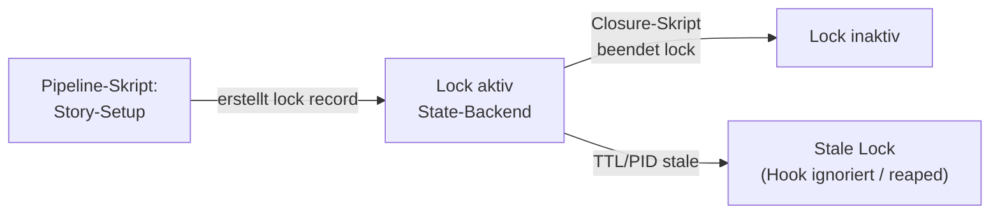

# 71 — Artefakt-Klassen, Envelope, Lock-Record und Stage-Registry

Dieses Kapitel beschreibt die Datenmodelle für Story-Artefakte:
Klassifikation, Envelope-Schema, QA-Artefakt-Schutz via Lock-Record
und die typisierte Stage-Registry. Das übergreifende Domänenmodell
(Begriffe, Story-Status-Modell, Identifikatoren, Invarianten) liegt
in **FK-02**.

## 71.1 Artefaktklassen und Ownership

### 71.1.1 Artefaktklassen

| Klasse | Erzeuger | Schutz | Beispiele |
|--------|----------|--------|-----------|
| **Worker-Artefakte** | Worker-Agent | Kein Schutz (Agent kann überschreiben) | `worker-manifest.json`, `protocol.md`, Quellcode |
| **QA-Artefakte** | Pipeline-Skripte, QA-Agenten | Schreibschutz via Lock-Record + Hook (§67.3) | kanonisch `artifact_records`; optionale Exporte wie `structural.json`, `policy.json`, `semantic_review.json` |
| **Pipeline-Artefakte** | Phase Runner, Preflight, Postflight | Implizit geschützt (nur Pipeline schreibt) | kanonisch `story_contexts`, `flow_executions`, `phase_state_projection`; materialisierte Exporte wie `phase-state.json`, `context.json` sind nur Projektionen |
| **Telemetrie** | `telemetry_service` | Zentrales State-Backend, optionaler Export bei Closure | `execution_events` (Laufzeit), Export-Bundle (Archiv) |
| **Governance-Artefakte** | Guards, Integrity-Gate | Log-only | `integrity-violations.log` |
| **Entwurfsartefakte** | Worker (Exploration) | Read-only nach Freeze | `entwurfsartefakt.json` |
| **Handover-Artefakte** | Worker (Implementation) | Kein Schutz | `handover.json` |
| **Adversarial-Test-Sandbox** | Adversarial Agent | Ephemer, nur in Sandbox-Pfad | `_temp/adversarial/{story_id}/` — Tests werden hier geschrieben und ausgeführt. Promotion ins Repo nur durch Pipeline-Skript (schema-valide, ausführbar, dedupliziert). |

### 71.1.2 Geschützte QA-Artefakte (vollständige Liste)

Diese Export-Dateinamen sind durch den Integrity-Hook gegen
Schreibzugriff durch den Worker geschützt. Der Schutz betrifft die
Materialisierung, nicht die kanonische Wahrheit, die im State-Backend
liegt:

```python
PROTECTED_ARTIFACTS = [
    "structural.json",
    "semantic.json",
"qa_review.json",
"semantic_review.json",
    "adversarial.json",
    "decision.json",
    "closure.json",
    "context.json",
    "phase-state.json",
    "integrity-gate.json",
    "guardrail.json",
    "integrity-violations.log",
]
```

## 71.2 Artefakt-Envelope-Schema

Alle QA-Artefakte nutzen ein gemeinsames Envelope-Schema. Das
Envelope trägt Metadaten, die das Integrity-Gate validiert.

```json
{
  "schema_version": "3.0",
  "story_id": "PROJ-042",
  "run_id": "a1b2c3d4-e5f6-7890-abcd-ef1234567890",
  "stage": "qa_structural",
  "attempt": 1,
  "producer": {
    "type": "script",
    "name": "qa-structural-check"
  },
  "started_at": "2026-03-16T14:00:00+01:00",
  "finished_at": "2026-03-16T14:01:23+01:00",
  "status": "PASS",
  "...": "stage-spezifische Felder"
}
```

**Pflichtfelder:**

| Feld | Typ | Validierung |
|------|-----|-------------|
| `schema_version` | String | Muss `"3.0"` sein |
| `story_id` | String | Muss FK-Story-ID-Pattern matchen |
| `run_id` | String | UUID v4 |
| `stage` | String | Einer der definierten Stage-IDs |
| `attempt` | Integer | ≥ 1 |
| `producer.type` | String | `"script"` oder `"agent"` |
| `producer.name` | String | Bekannter Producer-Name |
| `started_at` | String | ISO 8601 mit Zeitzone |
| `finished_at` | String | ISO 8601, ≥ started_at |
| `status` | String | `PASS`, `FAIL`, `WARN`, `ERROR` |

**Mapping LLM-Check-Status zu Artefakt-Status:**

LLM-Bewertungen (QA-Review, Semantic Review, Dokumententreue) liefern
pro Check einen von drei Werten: `PASS`, `PASS_WITH_CONCERNS`, `FAIL`
(FK-05-159..166). Bei der Aggregation zum Artefakt-Envelope wird
`PASS_WITH_CONCERNS` auf `WARN` gemappt:

| LLM-Check-Status | Artefakt-Envelope-Status | Semantik |
|-------------------|--------------------------|----------|
| `PASS` | `PASS` | Check bestanden |
| `PASS_WITH_CONCERNS` | `WARN` | Grundsätzlich ok, aber Hinweise — blockiert nicht, fließt als Warnung in Policy + Adversarial (FK-05-165/166) |
| `FAIL` | `FAIL` | Check nicht bestanden — blockiert Story (FK-05-164) |

`ERROR` ist kein LLM-Ergebnis, sondern ein Infrastruktur-Fehler
(z.B. LLM nicht erreichbar, Schema-Parsing gescheitert nach Retry).

**Producer-Registry** (welcher Producer darf welchen Export
materialisieren):

| Export-Artefakt | Erlaubter Producer |
|-----------------|-------------------|
| `structural.json` | `qa-structural-check` |
| `policy.json` / Legacy-Export `decision.json` | `qa-policy-engine` |
| `phase-state.json` | `run-phase` (Export der `phase_state_projection`) |
| `context.json` | `compute-story-context` (Export aus `StoryContext`) |
| `qa_review.json` | `qa-llm-review` |
| `semantic_review.json` | `qa-semantic-review` |
| `adversarial.json` | `qa-adversarial` |
| `closure.json` | `story-closure` |

Das Integrity-Gate prüft bei Closure kanonisch die Producer- und
Provenienzfelder der zugrunde liegenden Records. Exportdateien werden
höchstens konsistenzhalber oder für menschliche Audit-Pakete geprüft,
nicht als operative Wahrheitsquelle.

## 71.3 Lock-Mechanismus für QA-Artefaktschutz

### 71.3.1 Prinzip: Hook + Lock-Record als Zusammenspiel

Lock-Records ersetzen keine Hooks — sie erweitern sie. Der Hook
(CCAG oder dedizierter PreToolUse-Hook) ist der Enforcement-Mechanismus.
Der Lock-Record ist der Zustandsträger, der dem Hook mitteilt, ob
gerade eine Sperre aktiv ist.

Dieses Muster ist bereits heute beim Preflight implementiert: Wenn der
Preflight fehlschlägt, schreibt das Preflight-Skript einen Lock-Record,
die den CCAG-Hook veranlasst, dem Orchestrator-Agent **sämtliche
Tool-Aufrufe** zu verbieten — die agentische Pipeline wird hart
angehalten. Derselbe Mechanismus wird für den QA-Artefakt-Schutz
angewendet.

### 71.3.2 Anwendung: QA-Artefakt-Schutz via zentralem Lock-Record

Das Tooling (Execute-User-Story-Skill bzw. Pipeline-Skripte) legt
bei Story-Start automatisch einen **zentralen Lock-Record** im
State-Backend an. Der Agent selbst weiß davon nichts und kann ihn
nicht beeinflussen.

**Lock-Record:** fachlich `qa_artifact_write_lock`

**Inhalt (logisch):**
```json
{
  "project_key": "odin-trading",
  "story_id": "PROJ-042",
  "run_id": "a1b2c3d4-e5f6-7890-abcd-ef1234567890",
  "lock_type": "qa_artifact_write",
  "created_at": "2026-03-16T14:00:00+01:00",
  "scope_refs": [
    "artifact_class:qa"
  ],
  "owner_principal": "pipeline_script",
  "owner_pid": 12345,
  "ttl_s": 86400
}
```

**Lebenszyklus:**



1. **Erstellung:** Das Setup-Skript (nicht der Agent) erstellt
   den Lock-Record als Teil der Guard-Aktivierung.
2. **Wirkung:** Hook prüft bei jedem Tool-Call von Sub-Agents,
   ob ein aktiver Lock-Record für die Story existiert.
   Wenn ja: Zugriff auf gesperrte QA-Artefakte wird blockiert.
3. **Beendigung:** Das Closure-Skript markiert oder entfernt den
   Lock-Record nach erfolgreichem Abschluss.
4. **Stale-Erkennung (zweistufig):**
   - **PID-Prüfung (primär):** Der Lock-Record enthält die PID des
     orchestrierenden Prozesses (`owner_pid`). Der Hook prüft vor
     der Blockade, ob der Prozess noch läuft (`os.kill(pid, 0)`).
     Ist der Prozess tot, gilt der Lock sofort als stale.
   - **TTL (Fallback):** Falls die PID-Prüfung nicht greift, wird
     der Lock nach `ttl_s` Sekunden als stale behandelt.

### 71.3.3 Scoping: Nur Sub-Agents gesperrt

Die Sperre gilt **nur für Sub-Agents** (Worker, QA, Adversarial),
nicht für den Hauptagenten oder Pipeline-Skripte:

| Akteur | Zugriff auf gesperrte QA-Pfade | Begründung |
|--------|-------------------------------|------------|
| Pipeline-Skripte (Python) | Erlaubt | Schreiben QA-Artefakte als Teil des deterministischen Ablaufs |
| Hauptagent (Orchestrator) | Erlaubt (lesen) | Muss QA-Ergebnisse auswerten, um Entscheidungen zu treffen |
| Sub-Agent (Worker) | **Blockiert** | Darf eigene QA-Ergebnisse nicht manipulieren |
| Sub-Agent (QA/Adversarial) | **Blockiert** | Dürfen nur über Pipeline-Skripte schreiben, nicht direkt |

### 71.3.4 CCAG-Regel

```yaml
# In .claude/ccag/rules/subagents.yaml
- id: qa-artifact-lock
  description: "Blockiert Sub-Agent-Zugriff auf QA-Verzeichnisse während Story-Umsetzung"
  scope: subagent
  condition:
    state_backend_has_active_lock: "qa_artifact_write"
  tools: [Write, Edit, Bash]
  block_scope: "artifact_class:qa"
  action: block
  message: "Operation not permitted."
```

### 71.3.5 Zusammenspiel Hook + Lock-Record

| Aspekt | Ohne Lock-Record | Mit Lock-Record |
|--------|----------------|---------------|
| Zustand | Kein Story-Lauf aktiv | Story-Umsetzung läuft |
| QA-Verzeichnisse | Frei zugänglich (normaler Alltag) | Durch Hook gesperrt für Sub-Agents |
| Hook-Verhalten | Hook prüft, findet keinen aktiven Lock, winkt durch | Hook prüft, findet aktiven Lock, blockiert |
| Wer steuert die Sperre | — | Pipeline-Tooling (nicht der Agent) |

**Bestehendes Muster (Preflight):**
Preflight schreibt bei Failure → zentraler `preflight_lock`-Record → CCAG-Hook
blockiert ALLE Tool-Aufrufe des Orchestrators → Pipeline komplett
angehalten.

**Neues Muster (QA-Artefakt-Schutz):**
Setup schreibt bei Story-Start → `qa_artifact_write_lock`-Record → Hook blockiert
Sub-Agent-Zugriff auf QA-Pfade → nur Pipeline-Skripte können
QA-Artefakte schreiben.

## 71.4 Typisierte Stage-Registry

Die Verify-Pipeline arbeitet fachlich in vier Schichten (FK 5.2).
Die Stage-Registry bildet diese Struktur typisiert ab statt als
freie String-IDs.

**Stage-Modell:**

```python
@dataclass(frozen=True)
class StageDefinition:
    id: str                     # z.B. "structural"
    layer: int                  # Verify-Schicht: 1, 2, 3, 4
    kind: str                   # "deterministic" | "llm_evaluation" | "agent" | "policy"
    applies_to: set[str]        # Story-Typen: {"implementation", "bugfix"}
    blocking: bool              # Blockiert bei FAIL
    trust_class: str | None     # "A", "B", "C" oder None
    producer: str               # Erlaubter Producer-Name
```

**Standard-Stages:**

| ID | Schicht | Kind | Gilt für | Blocking | Trust | Producer |
|----|---------|------|----------|----------|-------|----------|
| `structural` | 1 | deterministic | implementation, bugfix | ja | — | `qa-structural-check` |
| `qa_review` | 2 | llm_evaluation | implementation, bugfix | ja | — | `qa-llm-review` |
| `semantic_review` | 2 | llm_evaluation | implementation, bugfix | ja | — | `qa-semantic-review` |
| `adversarial` | 3 | agent | implementation, bugfix | nein | — | `qa-adversarial` |
| `policy` | 4 | policy | implementation, bugfix | ja | — | `qa-policy-engine` |
| `concept_feedback` | — | llm_evaluation | concept | ja | — | `qa-concept-feedback` |
| `research_quality` | — | deterministic | research | nein | — | `qa-research-check` |

Die Stage-Registry ersetzt die freien String-Listen in
`policy.required_stages`. Die Policy-Engine iteriert über die
Registry und wertet nur Stages aus, die für den aktuellen
Story-Typ gelten.

